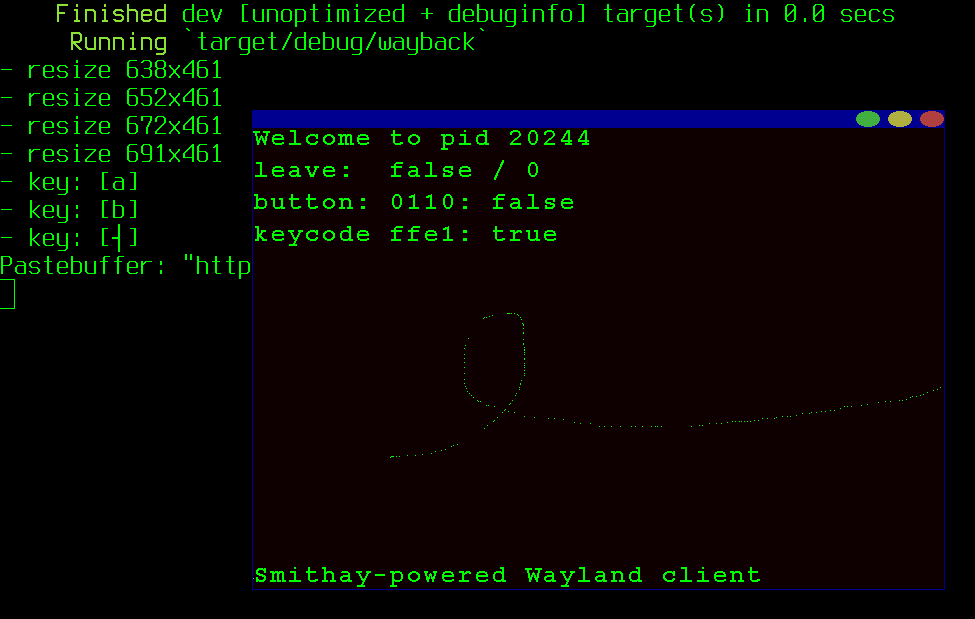

# wayback (aka: "mom, I did it again!")
I started experimenting with [Smithay Wayland client](https://smithay.github.io) but I found its Client Toolkit to still require quite a bit of boilerplate code.

My (childish) idea is a *main()* calling some initialize function and then just loop asking for next relevant Wayland event (without blocking) or drawing something. Thus I built my boilerplate code upon Smithay's Client Toolkit, threw in a bitmapped font and a hacked copy of its *BasicFrame* window decoration, and got a working Wayland application running on Ubuntu 18.04 (with Gnome 3.28 in a Wayland session).

Use case: rewriting some simple text-only application to use graphics and pointers, without having to fiddle with monster-sized event-driven libraries (like Qt) or compositor internals.

Current release was tested on Smithay's [9e07be7](https://github.com/Smithay/client-toolkit/commits/9e07be7)

*Disclaimer:* I don't know much about Wayland programming; also, I almost didn't read any documentation except Smithay's source comments.

## todo
* wait for Smithay client toolkit to get stable
* make boilerplate a library/crate
